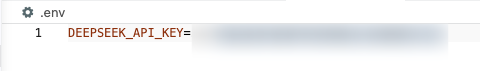

# 前 unity 客户端开发转 Agent 开发
*环境：macOS 26、VS code*

## Day 1
- Python 环境部署和优化
  - Python 我本来已经安装好了，安装也很简单，这里不展开  
    （也可 👉 等后面 uv 工具安装好之后再来安装 Python ）
  
  - 但是 macOS 下 Python 包管理极其混乱，有以下三个问题 ⬇️
    - 路径地狱：电脑里同时存在系统 Python、pyenv 版本和 venv 环境。明明激活了环境，但 which pip 偶尔还是会指向别处，导致“库装在 A 处，程序去 B 处找”，引发 ModuleNotFoundError。

    - 证书高墙 (SSL Error)： Mac + pyenv 环境极其“死板”，不带根证书，导致 Python 无法访问 HTTPS 网站。安装库时频繁被 CERTIFICATE_VERIFY_FAILED 拦截。

    - 繁琐的仪式感：每次开新项目都要经历 mkdir -> venv -> source -> pip install -> pip install certifi 等一系列“规定动作”，不仅累，还容易忘。
  
  - 安装 uv 包与环境管理工具可以解决上述问题 👆  
    👉 `brew install uv`  
    
    选一个你想存放项目的位置新建项目，并进行项目初始化，会自动帮你创建必须的工程文件  
    👉 `uv init my_project`  
    
    <u>后续全部直接用 uv 工具下载第三方库，详见[ uv 菜鸟教程 ](https://www.runoob.com/python3/uv-tutorial.html)</u>

  - 安装 python-dotenv 库  
    👉 `uv add python-dotenv`  
    用作管理环境变量，避免大模型的 api_key 被泄露  
      - 创建一个 .env 文件，声明一个环境变量（命名随意）  
        

      - 防止这个文件被 commit，要去 .gitignore 文件中确认是否忽略了这个后缀

  - （选做）安装 pre-commit 库
    - 实用 Git Hook，当执行 git commit 时，系统会自动运行脚本。
      - 安装工具  
      👉 `uv add pre-commit`

      - 创建 .pre-commit-config.yaml 文件，配置它在提交前要运行的脚本

      - 

  - 安装 openai 库  
    `uv add openai`  
    用作调用 DeepSeek 的 API（在此之前，先去 DeepSeek 用一块钱购买 Tokens），虽然我们用的是 openai 库，但通过修改 base_url，我们可以给任何兼容 OpenAI 格式的服务发请求